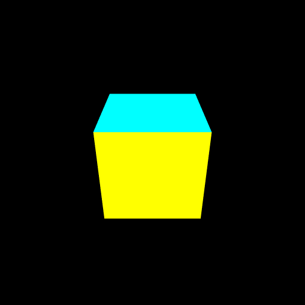

# VAO (Vertex Array Object: 頂点配列オブジェクト)
頂点配列オブジェクトを使って描画します。

# 課題
次の問題に挑戦してみてください。

- 頂点バッファを「位置」と「色」で分けてみよう

# 課題の進め方
次のように課題を解いてみてください。

- プロジェクトをforkします
- GitHub Pages の機能を使って、ホームページを立ち上げます
- 問題を解きます
- GitHub Pages で正答したか確認しましょう

